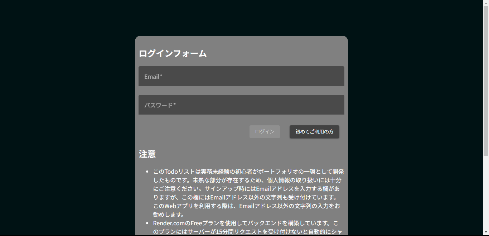
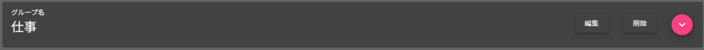

# web-todo-list
フロントエンドをAngularでバックエンドをSpring Bootで作成したTodoリストアプリ

## 想定環境
Windows 11  
Node ver. 18.18.2  
npm ver. 9.8.1  
Angular CLI ver. 16.2.6  
Eclipse Pleiades All in One Java Full Edition 2023-09  
Spring Boot ver. 3.1.5  
dependency management ver. 1.1.3  
jdk 17  
PostgreSQL ver. 15.4  

## フロントエンド側
### 実行手順

以下のコマンドを実行する。

```powershell
cd frontend/todo-list
npm install
ng serve
```

## バックエンド側
### 実行手順

1. Eclipseでファイル>インポート>一般>フォルダーまたはアーカイブからプロジェクトでbackendフォルダ内のtodoListフォルダをインポートする。
2. application.propertiesの設定を行う。  
dbnameにデータベース名を、usernameにユーザー名を、passwordにパスワードを設定する。
```
spring.jpa.database=POSTGRESQL
spring.datasource.url=jdbc:postgresql://localhost:5432/dbname
spring.datasource.username=username
spring.datasource.password=password
```
3. todoListのプロジェクトを選択した状態でSpring Bootアプリケーションとして実行する。

## 機能説明

### スタート画面
<p align="center">
  
</p>
<p align="center">
  図1. スタート画面
</p>

スタート画面です。バックエンドサーバーの起動までの時間はスピナーが回転しています。バックエンドサーバーが起動すると、ログインボタンが有効化されます。マイページへボタンはログイン済みのユーザーがログアウトせずに1日以内にスタート画面を表示した際に有効化され、ログイン処理を省略してタスク一覧画面に遷移することができます。

## ログイン画面
<p align="center">
  
</p>
<p align="center">
  図2. ログイン画面
</p>

ログイン画面です。ここではログインを行うことができます。ユーザー登録済みのユーザーはここで登録しているEmailとパスワードを入力することでログインできます。初めて利用する方、新しくアカウントを作成した方は初めてご利用の方ボタンを押してください。サインアップ画面に遷移します。

## サインアップ画面
<p align="center">
  
</p>
<p align="center">
  図3. サインアップ画面
</p>

サインアップ画面です。ここでは新しいアカウントを作成できます。

>[!CAUTION]
>このアプリは独学でポートフォリオ用に作成したアプリでセキュリティ対策は万全ではありません。Emailの欄がありますが、Email以外の入力も受け付けています。ここでは、Email以外の入力を推奨します。セキュリティについては今後の課題としています。

## タスク一覧
<p align="center">
  
</p>
<p align="center">
  図4. タスク一覧画面
</p>
<p align="center">
  
</p>
<p align="center">
  図5. タスクカード
</p>
<p align="center">
  
</p>
<p align="center">
  図6. 詳細表示中のタスクカード
</p>

図4にタスク一覧画面を示します。タスク一覧の機能一覧を以下に示します。タスクカードは図5に示しているものです。トグルボタンはタスクカードの一番右のピンク色のボタンです。

### 機能一覧
| トリガー | 機能 |
----|---- 
| タスクカードをクリックする | タスク詳細画面へ遷移する |
| タスクの状態のプルダウンの値を変更する | タスクの状態を変更する |
| 編集ボタンをクリックする | タスク編集画面へ遷移する |
| 削除ボタンをクリックする | タスクを削除する |
| トグルボタンをクリックする | タスクの詳細の表示、非表示を切り替える |
| フィルターの適用ボタンをクリックする | フィルターの項目に入力された内容でフィルターを適用する |

## グループ一覧
<p align="center">
  
</p>
<p align="center">
  図7. グループ一覧画面
</p>
<p align="center">
  
</p>
<p align="center">
  図8. グループカード
</p>
<p align="center">
  
</p>
<p align="center">
  図9. 詳細表示中のグループカード
</p>

図7にグループ一覧画面を示します。グループ一覧の機能一覧を以下に示します。グループカードは図8に示しているものです。

### 機能一覧
| トリガー | 機能 |
----|---- 
| グループカードをクリックする | グループ詳細画面へ遷移する |
| 編集ボタンをクリックする | グループ編集画面へ遷移する |
| 削除ボタンをクリックする | グループを削除する |
| トグルボタンをクリックする | グループの詳細の表示、非表示を切り替える |

## タスク作成
<p align="center">
  
</p>
<p align="center">
  図10. タスク作成画面
</p>

タスク作成画面です。タスク作成画面ではタスクの内容を入力して作成ボタンをクリックすることでタスクを作成できます。必須項目には`*`が付いています。必須項目の入力によって作成ボタンが有効化されます。

## グループ作成
<p align="center">
  
</p>
<p align="center">
  図11. グループ作成画面
</p>

グループ作成画面です。グループ作成画面ではグループの内容を入力して作成ボタンをクリックすることでグループを作成できます。必須項目には`*`が付いています。必須項目の入力によって作成ボタンが有効化されます。

## タスク編集
<p align="center">
  
</p>
<p align="center">
  図12. タスク編集画面
</p>

タスク編集画面です。タスク編集画面では更新したいタスクの内容を入力して完了ボタンをクリックすることでタスクを編集できます。必須項目には`*`が付いています。必須項目の入力によって完了ボタンが有効化されます。

## グループ編集
<p align="center">
  
</p>
<p align="center">
  図13. グループ編集画面
</p>

グループ編集画面です。グループ編集画面では更新したいグループの内容を入力して完了ボタンをクリックすることでグループを編集できます。必須項目には`*`が付いています。必須項目の入力によって完了ボタンが有効化されます。

## タスク詳細
<p align="center">
  
</p>
<p align="center">
  図14. タスク詳細画面
</p>

タスク詳細画面です。タスク詳細画面の機能一覧を以下に示します。

### 機能一覧
| トリガー | 機能 |
----|---- 
| グループのプルダウンの値を変更する | タスクが登録されているグループを変更する |
| タスクの状態のプルダウンの値を変更する | タスクの状態を変更する |
| 編集ボタンをクリックする | タスク編集画面へ遷移する |
| 削除ボタンをクリックする | タスクを削除する |

## グループ詳細
<p align="center">
  
</p>
<p align="center">
  図15. グループ詳細画面
</p>

グループ詳細画面です。グループ詳細画面の機能一覧を以下に示します。

### 機能一覧
| トリガー | 機能 |
----|---- 
| タスクカードをクリックする | タスク詳細画面へ遷移する |
| タスクの状態のプルダウンの値を変更する | タスクの状態を変更する |
| タスクカードの編集ボタンをクリックする | タスク編集画面へ遷移する |
| タスクカードの排除ボタンをクリックする | タスクをグループから排除する |
| タスクカードの削除ボタンをクリックする | タスクを削除する |
| タスクカードのトグルボタンをクリックする | タスクの詳細の表示、非表示を切り替える |
| 画面下部の編集ボタンをクリックする | グループ編集画面へ遷移する |
| 画面下部の削除ボタンをクリックする | グループを削除する |
